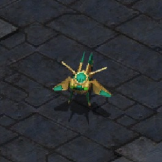

# Probe

Probe is a coding agent.

It ships session persistence, tool execution, approvals, backend attachment,
and CLI/TUI surfaces for local coding work.

Current shipped surface:

- `probe exec` for one-shot turns
- `probe chat` for daemon-backed interactive sessions plus resume
- `probe codex login|status|logout` for ChatGPT/Codex subscription auth
- `probe tui` / `cargo probe` for the local terminal UI plus explicit
  detached-session reattach with `--resume`
- three inference lanes in the TUI: Codex, Psionic OpenAI-compatible
  attach targets including Mesh, Qwen or Tailnet, and Apple FM
- `probe-server` for the first typed local stdio supervision contract
- `probe-daemon` for the first long-lived local Unix-socket supervision path
- `probe daemon run|stop` plus `probe ps|attach|logs|stop` for local detached
  session supervision
- a shared `probe-client` layer underneath `exec`, `chat`, and the TUI so
  first-party surfaces now speak one server contract
- `coding_bootstrap` tools, approvals, and harness profiles
- append-only local transcripts under `PROBE_HOME` or `~/.probe`
- bounded oracle and long-context escalation lanes
- local acceptance/eval and module-optimization tooling

## Backends

Probe currently ships four backend profiles across three backend families:

- `psionic-qwen35-2b-q8-registry`
  - base URL: `http://127.0.0.1:8080/v1`
  - model: `qwen3.5-2b-q8_0-registry.gguf`
- `psionic-inference-mesh`
  - attach target: Psionic OpenAI-compatible server plus
    `/psionic/management/status`
  - default base URL: `http://127.0.0.1:8080/v1`
  - selected model: resolved from live mesh management state
  - stored metadata: routed model inventory, local mesh role or posture, and
    proxied fallback truth
  - optional adjunct: session-scoped coordination reads or posts through
    `/psionic/management/coordination/*` without mutating Probe transcript or
    approval truth
- `openai-codex-subscription`
  - base URL: `https://chatgpt.com/backend-api/codex`
  - request endpoint: `https://chatgpt.com/backend-api/codex/responses`
  - model: `gpt-5.4`
  - reasoning level: `backend_default`
  - auth source: `PROBE_HOME/auth/openai-codex.json`
- `psionic-apple-fm-bridge`
  - default base URL: `http://127.0.0.1:11435`
  - model: `apple-foundation-model`
  - override order: `PROBE_APPLE_FM_BASE_URL`, then `OPENAGENTS_APPLE_FM_BASE_URL`

Apple FM is attach-only. Probe checks `GET /health` before use and stays honest
about unavailable or non-admitted machines.
Codex is also attach-only, but its attach target is the hosted ChatGPT Codex
endpoint rather than a local Psionic server.
The mesh profile is attach-only as well. Probe discovers live routed inventory
from `GET /psionic/management/status`, picks the effective model from that
inventory, prints the mesh role or fallback posture in operator output, and
stores the same typed snapshot in session metadata without pretending it owns
mesh startup or warmup. Probe can also query or post the optional mesh
coordination adjunct for a session through the runtime or `probe-client`
surface, but that data remains outside the append-only transcript and outside
pending-approval invariants.
Tool-enabled Codex turns default to the Probe-owned
`coding_bootstrap_codex@v1` prompt contract, while plain Codex turns use a
small Codex-specific system prompt instead of the generic local-Qwen path.

## Quick Start

Run the TUI:

```bash
cargo probe
```

Run a one-shot turn:

```bash
cargo run -p probe-cli -- exec "Explain what this repository does."
```

Start an interactive session:

```bash
cargo run -p probe-cli -- chat
```

Start an interactive Codex-backed session:

```bash
cargo run -p probe-cli -- chat --profile openai-codex-subscription
```

Start an interactive Psionic mesh-backed session:

```bash
cargo run -p probe-cli -- chat \
  --profile psionic-inference-mesh \
  --server-host 100.88.7.9 \
  --server-port 8080
```

Run the local stdio server contract directly:

```bash
cargo run -p probe-server -- --probe-home ~/.probe
```

Run the long-lived local daemon:

```bash
cargo run -p probe-daemon -- run --probe-home ~/.probe
```

Tune detached watchdog budgets when needed:

```bash
cargo run -p probe-cli -- daemon run \
  --probe-home ~/.probe \
  --watchdog-stall-ms 30000 \
  --watchdog-timeout-ms 300000
```

Inspect detached sessions:

```bash
cargo run -p probe-cli -- ps --probe-home ~/.probe
```

Inspect one detached session:

```bash
cargo run -p probe-cli -- attach <session-id> --probe-home ~/.probe
```

Tail detached session logs:

```bash
cargo run -p probe-cli -- logs <session-id> --probe-home ~/.probe --follow
```

Stop detached work for one session:

```bash
cargo run -p probe-cli -- stop <session-id> --probe-home ~/.probe
```

Stop the daemon after detached work is drained:

```bash
cargo run -p probe-cli -- daemon stop --probe-home ~/.probe
```

Resume a session:

```bash
cargo run -p probe-cli -- chat --resume <session-id>
```

Reattach the TUI to a detached session:

```bash
cargo run -p probe-cli -- tui --resume <session-id>
```

Run a tool-enabled turn:

```bash
cargo run -p probe-cli -- exec \
  --tool-set coding_bootstrap \
  --harness-profile coding_bootstrap_default \
  --tool-choice auto \
  "Read README.md and summarize what this repository does."
```

## Auth With ChatGPT

Probe can use your ChatGPT subscription for the hosted Codex lane. This does
not use `PROBE_OPENAI_API_KEY`.

Prerequisite:

- sign in to a ChatGPT account with the Codex-capable subscription you want to use

Recommended browser flow:

```bash
# start local browser auth
cargo run -p probe-cli -- codex login --method browser
```

Probe will print the authorize URL, open the browser when possible, wait for
the localhost callback, and then persist the resulting auth state at
`PROBE_HOME/auth/openai-codex.json`.

If you are on a headless machine or do not want Probe to open the browser:

```bash
# browser auth, but copy the URL manually
cargo run -p probe-cli -- codex login --method browser --no-open-browser

# device-code auth
cargo run -p probe-cli -- codex login --method headless
```

Verify or clear the saved ChatGPT auth:

```bash
# inspect the saved auth record
cargo run -p probe-cli -- codex status

# delete the saved auth record
cargo run -p probe-cli -- codex logout
```

Probe persists this state at `PROBE_HOME/auth/openai-codex.json` with private
file permissions. The current TUI backend overlay also shows whether that auth
state exists and whether it is expired.

After auth succeeds, use the ChatGPT-backed Codex profile directly:

```bash
# interactive Codex chat
cargo run -p probe-cli -- chat --profile openai-codex-subscription

# one-shot Codex turn
cargo run -p probe-cli -- exec \
  --profile openai-codex-subscription \
  "Reply with the exact text: codex backend ready"
```

In the TUI, launch `cargo probe` or `probe tui`, press `Tab` until the
`Codex` lane is selected, use `Shift+Tab` there to cycle Codex reasoning if
needed, and submit the prompt there.

The canonical Codex backend profile sends requests to
`https://chatgpt.com/backend-api/codex/responses` with subscription bearer auth
instead of using `PROBE_OPENAI_API_KEY`.

## TUI

`cargo probe` is the current top-level Probe UI entrypoint. The current shell
uses a retained transcript widget with committed user, tool, and assistant
turns plus one explicit active-turn cell. `Chat` is the home surface and the
composer now submits through the real Probe session loop. `probe tui` now uses the
same prepared backend contract as `probe chat`: it resolves the selected
backend, runs server readiness or attach preparation first, and then carries
the prepared host, port, model, backend kind, and attach mode into the UI.
The first submit creates a persisted Probe session; later submits continue that
same session. The active-turn cell is now driven by real session lifecycle
events, so the TUI can show model requests, tool request/start/completion,
refusal or pause, and the final assistant commit before the transcript delta
is rendered. Persisted tool activity renders as first-class transcript rows
such as `[tool call]`, `[tool result]`, and `[approval pending]` rather than
generic notes.

Probe now distinguishes backend streaming truth explicitly:
OpenAI-compatible backends stream assistant deltas, while Apple FM
streams full session snapshots rather than fake token deltas. The chat surface
now renders those streams honestly in place: one retained active cell grows
with streamed deltas or snapshot replacement until the authoritative
transcript rows land, streamed tool-call assembly stays visible before final
tool rows commit, and the bottom status bar carries a compact backend and
stream summary.

Setup, help, and approval flows live in a typed overlay stack above or in
place of the composer. The old setup surface is now a backend overlay:
Apple FM launches still foreground local Apple FM admission and setup truth,
while Qwen or Tailnet launches show the prepared attach target and operator
contract. The Codex lane instead shows the hosted backend contract plus local
ChatGPT subscription auth status from `PROBE_HOME/auth/openai-codex.json`.

The first supported remote-Qwen posture stays narrow and explicit:

- local Probe owns sessions, transcripts, tools, approvals, and UI
- remote Psionic serves inference only
- `127.0.0.1` attach is treated as local or SSH-forwarded
- `100.x.y.z` attach is treated as direct Tailnet attach

The top selector is now a backend switcher, not a view switcher. Probe keeps one
transcript-first home shell on screen at a time, and `Tab` flips the active
backend between the Codex subscription lane, the current Qwen or Tailnet lane,
and the Apple FM lane. `Shift+Tab` moves backward between lanes except on the
Codex lane, where it cycles reasoning instead. When the backend changes, Probe
resets the chat surface so the next submit starts a fresh session on that
backend instead of continuing the previous backend lane.
Each backend lane now keeps its own saved attach config under
`~/.probe/server/psionic-openai-chat-completions.json`,
`~/.probe/server/openai-codex-subscription.json`, or
`~/.probe/server/psionic-apple-fm.json`, so switching back does not fabricate a
fresh target.

The default `cargo probe` chat lane now auto-approves local tools and keeps
tool transcript rows terse. Tool calls and results render as compact command,
path, or error summaries instead of debug-shaped JSON blobs.

Keys:

- `Tab`: switch active backend
- `Shift+Tab`: on Codex, cycle reasoning; otherwise move to the previous backend
- `Enter`: submit the composer
- `Ctrl+J`: insert a newline
- `Up`, `Down`: recall draft history
- `Ctrl+O`: add an attachment placeholder to the draft
- `Ctrl+R`: rerun backend check when supported
- `Ctrl+S`: open backend overlay
- `Ctrl+A`: open approval overlay
- `Ctrl+T`: toggle operator notes vs live detail
- `F1`: help
- `Esc`: dismiss modal
- `Ctrl+C`: quit

The composer is active on the main transcript shell and disabled while overlays
own focus. The draft model tracks slash commands, typed mentions such as
`@skill:rust` or `@app:github`, attachment placeholders, submission history,
and multiline paste state. When a tool pauses for approval, Probe now persists
a real pending-approval record in `probe-core`, opens the approval overlay with
the live tool details, and resumes the paused turn after approve or reject
instead of leaving the operator in a dead-end pause state.

Remote attach examples:

```bash
# direct Tailnet attach
cargo run -p probe-cli -- tui \
  --profile psionic-qwen35-2b-q8-registry \
  --server-host 100.88.7.9 \
  --server-port 8080

# SSH-forwarded localhost attach
cargo run -p probe-cli -- tui \
  --profile psionic-qwen35-2b-q8-registry \
  --server-host 127.0.0.1 \
  --server-port 8080
```

## Dev Helpers

Repo-local helpers:

```bash
./probe-dev fmt
./probe-dev check
./probe-dev test
./probe-dev integration
./probe-dev accept-live
```

Probe intentionally does not keep GitHub CI workflows. Run the precommit lane
locally before pushing:

```bash
./probe-dev pr-fast
```

Useful focused lanes:

- `./probe-dev pr-fast`
- `./probe-dev cli-regressions`
- `./probe-dev integration`
- `./probe-dev accept-live`
- `./probe-dev self-test`
- `./probe-dev accept-compare`
- `./probe-dev matrix-eval`
- `./probe-dev optimizer-eval <lane>`

## Docs

Start with the optimizer-system doc, the runtime ownership doc, and the
workspace map if you need to understand how Probe is split today and where the
offline optimizer fits. For deeper TUI, backend, and streaming design history,
use `docs/README.md`; the full contributor start-here list now lives in
`AGENTS.md`.
